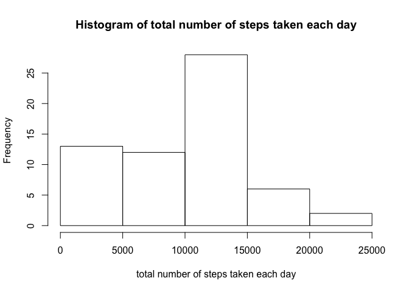
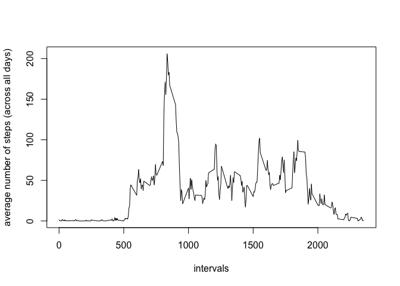
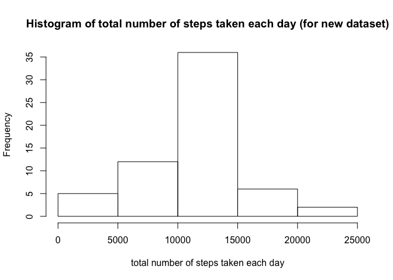

# Reproducible Research: Peer Assessment 1


## Loading and preprocessing the data

```r
  data <- read.csv("activity.csv")
```
Some processing of the data are done for the new dataset obtained below. Please see the relevant sections.

## What is mean total number of steps taken per day?

```r
  daily_total <- tapply(data$steps, data$date, sum, na.rm = TRUE)
  hist(daily_total, xlab = "total number of steps taken each day", main = "Histogram of total number of steps taken each day")
```

 

```r
  mean_old <- mean(daily_total)
  mean_old
```

```
## [1] 9354.23
```

```r
  median_old <- median(daily_total)
  median_old
```

```
## [1] 10395
```
The mean total number of steps taken per day is 9354.2295082. The median of the total number of steps taken per day is 10395.

## What is the average daily activity pattern?

```r
  m <- tapply(data$steps, data$interval, mean, na.rm = TRUE)
  ave <- data.frame(interval = as.numeric(names(m)), int_ave = m)
  plot(ave$interval, ave$int_ave, type = "l", xlab = "intervals", ylab = "average number of steps (across all days)")
```

 

The 5-minute interval, on average across all the days in the dataset, that contains the maximum number of steps is computed as follows:

```r
  ave[ave$int_ave == max(ave$int_ave), "interval"]
```

```
## [1] 835
```
This is the 5-minute interval starting from 8:35.

## Imputing missing values
The total number of missing values in the dataset is calculated as follows:

```r
  Num_Miss <- sum(is.na(data))
  Num_Miss
```

```
## [1] 2304
```
So there are 2304 rows where there are missing values.

Our strategy for filling in the missing values is by using the mean for that 5-minute interval. The new dataset obtained using this strategy is created as follows:

```r
  data_new <- data
  tf <- is.na(data_new[["steps"]])
  NA_int <- 1+ (data_new[tf, "interval"]%%100)/5 + 12*(data_new[tf, "interval"] - data_new[tf, "interval"]%%100)/100  ##convert 5-min intervals to row numbers; to be applied below 
  data_new[tf , "steps"] <- ave[NA_int,"int_ave"]
```

Below shows the histogram of the total number of steps taken each day and reports the mean and median total number of steps taken per day. 

```r
  daily_total_new <- tapply(data_new$steps, data_new$date, sum)
  hist(daily_total_new, xlab = "total number of steps taken each day", main = "Histogram of total number of steps taken each day (for new dataset)")
```

 

```r
  mean_new <- mean(daily_total_new)
  mean_new
```

```
## [1] 10766.19
```

```r
  median_new <- median(daily_total_new)
  median_new
```

```
## [1] 10766.19
```
The impact of filling in the missing values with this strategy is that the number in the 0-5000 range decreases while the number in the 10000-15000 range increases. The mean increases from 9354.2295082 to 1.0766189\times 10^{4} and the median increases from 10395 to 1.0766189\times 10^{4}. (It happens that the new mean is the same as the new median.)

## Are there differences in activity patterns between weekdays and weekends?
First we create a new factor variable in the dataset with two levels – “weekday” and “weekend” indicating whether a given date is a weekday or weekend day. The name for the new column is "Weekday_Or_Weekend".

```r
data_new$Weekday_Or_Weekend <- ifelse(weekdays(as.Date(data_new$date)) == "Saturday" |weekdays(as.Date(data_new$date)) == "Sunday", "weekend", "weekday")
data_new <- transform(data_new, Weekday_Or_Weekend = factor(Weekday_Or_Weekend)) ## Convert 'Weekday_Or_Weekend' to a factor variable
```


```r
  data1 <- data_new[data_new$Weekday_Or_Weekend == "weekday", ]
  m <- tapply(data1$steps, data1$interval, mean, na.rm = TRUE)
  ave1 <- data.frame(interval = as.numeric(names(m)), int_ave = m, Weekday_Or_Weekend = "weekday")
  
  
  data2 <- data_new[data_new$Weekday_Or_Weekend == "weekend", ]
  m <- tapply(data2$steps, data2$interval, mean, na.rm = TRUE)
  ave2 <- data.frame(interval = as.numeric(names(m)), int_ave = m, Weekday_Or_Weekend = "weekend")
  
  ave <- rbind(ave1, ave2)
  
  library(lattice)
  xyplot(int_ave ~ interval | Weekday_Or_Weekend, data = ave, layout = c(1, 2), type = "l", xlab = "Interval", ylab = "Number of steps")
```

 


